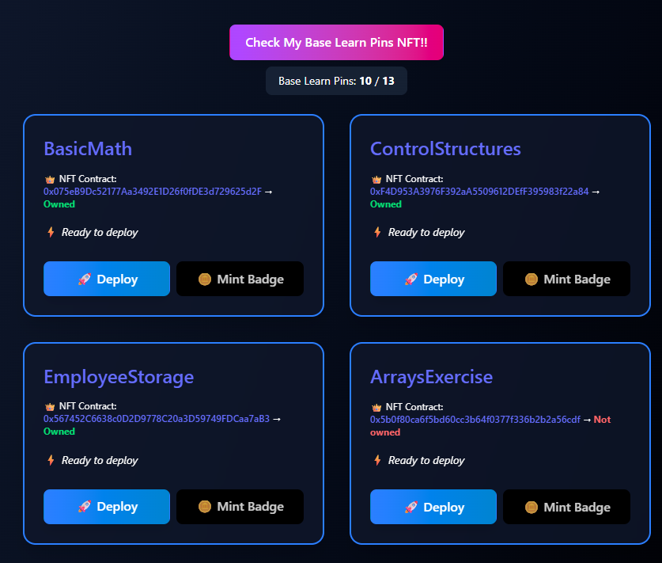

# Base Learn - Smart Contract Development Environment

A comprehensive Hardhat-based development environment for building and deploying smart contracts on Base blockchain, featuring a modern React frontend with Tailwind CSS and Web3 wallet integration.

## 🚀 Project Overview

This project is designed for learning and developing smart contracts with the following key features:

- **Smart Contracts**: Collection of educational Solidity contracts covering various concepts
- **Hardhat Development Environment**: Complete setup for compilation, testing, and deployment
- **Base Blockchain Integration**: Configured for Base mainnet and testnet deployments
- **Modern Frontend**: React application with Tailwind CSS and Web3 wallet connectivity
- **Multi-Contract Support**: Various contract types including ERC20, ERC721, and custom implementations



## 📁 Project Structure

```
├── contracts/              # Solidity smart contracts
│   ├── 01_BasicMath.sol
│   ├── 02_ControlStructures.sol
│   ├── 03_EmployeeStorage.sol
│   ├── 04_ArraysExercise.sol
│   ├── 05_FavoriteRecords.sol
│   ├── 06_GarageManager.sol
│   ├── 07_Inheritance.sol
│   ├── 08_ImportsExercise.sol
│   ├── 09_ErrorTriageExercise.sol
│   ├── 10_NewExercise.sol
│   ├── 11_UnburnableToken.sol
│   ├── 12_WeightedVoting.sol
│   ├── 13_HaikuNFT.sol
│   └── utils/
├── deploy/                 # Deployment scripts
│   ├── deploy.js
│   ├── erc20/
│   ├── erc721/
│   ├── perc20/
│   ├── private-nft/
│   └── proxy/
├── frontend/               # React frontend application
│   ├── src/
│   ├── public/
│   └── package.json
├── test/                   # Test files
├── artifacts/              # Compiled contracts
└── typechain-types/        # TypeScript type definitions
```

## 🛠️ Prerequisites

- **Node.js** (v16 or higher)
- **npm** or **yarn**
- **MetaMask** or compatible Web3 wallet
- **Base network** access (testnet/mainnet)

## ⚙️ Installation & Setup

### 1. Clone and Install Dependencies

```bash
# Install main project dependencies
npm install --force

# Install frontend dependencies
cd frontend
npm install
```

### 2. Environment Configuration

Create a `.env` file in the root directory:

```bash
# Copy from example
cp env_example .env
```

Edit `.env` file with your configuration:

```env
# Private key for deployment (use testnet account)
PRIVATE_KEY=your_private_key_here
```

**⚠️ Security Warning**: Never use your mainnet private key for testing. Always use a dedicated test account.

### 3. Network Configuration

The project is pre-configured for Base blockchain in `hardhat.config.ts`:

- **Base Mainnet**: Chain ID 8453
- **Base Goerli Testnet**: Chain ID 84531
- **Base Sepolia Testnet**: Chain ID 84532

## 🔧 Development Commands

### Smart Contract Development

```bash
# Compile contracts
npx hardhat compile

# Run tests
npx hardhat test

# Deploy to Base testnet
npx hardhat run --network baseSepolia deploy/deploy.js

# Deploy to Base mainnet
npx hardhat run --network base deploy/deploy.js

# Verify contract (requires BASESCAN_API_KEY)
npx hardhat verify --network base CONTRACT_ADDRESS

# Start local Hardhat node
npx hardhat node
```

### Frontend Development

```bash
# Navigate to frontend directory
cd frontend

# Start development server
npm run dev

# Build for production
npm run build

# Preview production build
npm run preview
```

## 📚 Smart Contract Examples

### Basic Contracts
- **BasicMath**: Mathematical operations and basic Solidity syntax
- **ControlStructures**: If/else statements, loops, and control flow
- **EmployeeStorage**: Struct usage and state management

### Intermediate Contracts
- **ArraysExercise**: Dynamic arrays and array manipulation
- **FavoriteRecords**: Mapping usage and data structures
- **GarageManager**: Complex state management example

### Advanced Contracts
- **Inheritance**: Contract inheritance patterns
- **ImportsExercise**: Modular contract development
- **ErrorTriageExercise**: Error handling and custom errors

### Token Contracts
- **UnburnableToken**: ERC20 token implementation
- **HaikuNFT**: ERC721 NFT contract
- **WeightedVoting**: Governance token with voting mechanism

## 🌐 Frontend Features

The React frontend includes:

- **Wallet Connection**: MetaMask and WalletConnect integration via RainbowKit
- **Contract Interaction**: Read and write operations with smart contracts
- **Tailwind CSS**: Modern, responsive UI components
- **Web3 Integration**: ethers.js and wagmi for blockchain interactions

### Frontend Tech Stack
- **React 19**: Latest React with concurrent features
- **Tailwind CSS v4**: Utility-first CSS framework
- **Vite**: Fast build tool and development server
- **ethers.js**: Ethereum library for blockchain interaction
- **wagmi**: React hooks for Ethereum
- **RainbowKit**: Wallet connection UI

## 🚀 Deployment Guide

### Deploy Individual Contracts

```bash
# Deploy specific contract type
npx hardhat run --network base deploy/erc20/deploy.js
npx hardhat run --network base deploy/erc721/deploy-erc721.js
npx hardhat run --network base deploy/proxy/deploy.ts
```

### Deploy with Verification

```bash
# Deploy and verify in one command
npx hardhat run --network base deploy/deploy.js && \
npx hardhat verify --network base <CONTRACT_ADDRESS>
```

## 🧪 Testing

Run the complete test suite:

```bash
# Run all tests
npx hardhat test

# Run specific test file
npx hardhat test test/Lock.ts

# Run tests with gas reporting
REPORT_GAS=true npx hardhat test

# Run tests with coverage
npx hardhat coverage
```

## 🛡️ Security Considerations

1. **Private Keys**: Never commit private keys to version control
2. **Test Networks**: Always test on testnets before mainnet deployment
3. **Contract Verification**: Verify all contracts on Basescan
4. **Audit**: Consider professional audits for production contracts
5. **Access Control**: Implement proper access controls in contracts

## 📖 Learning Resources

### Solidity Concepts Covered
- Basic syntax and data types
- Control structures and functions
- Structs, arrays, and mappings
- Contract inheritance
- Error handling
- ERC20/ERC721 token standards
- Upgradeable contracts with proxies

### Recommended Learning Path
1. Start with `01_BasicMath.sol` for Solidity basics
2. Progress through numbered contracts in order
3. Experiment with frontend integration
4. Deploy to testnet and interact via UI
5. Explore advanced patterns in proxy contracts

## 🤝 Contributing

1. Fork the repository
2. Create a feature branch
3. Make your changes
4. Add tests for new functionality
5. Submit a pull request

## 📝 License

This project is licensed under the MIT License - see the LICENSE file for details.

## 🆘 Troubleshooting

### Common Issues

**Contract compilation fails:**
```bash
npx hardhat clean
npx hardhat compile
```

**Frontend won't start:**
```bash
cd frontend
rm -rf node_modules package-lock.json
npm install
```

**Deployment fails:**
- Check your private key format (with 0x prefix)
- Ensure sufficient ETH balance for gas fees
- Verify network configuration in hardhat.config.ts

**Tailwind CSS not working:**
- Ensure `@import "tailwindcss";` is in index.css
- Check that `@tailwindcss/vite` plugin is in vite.config.js

## 📞 Support

For questions and support:
- Check existing issues in the repository
- Create a new issue with detailed description
- Include error messages and system information

---

**Happy coding! 🎉**
